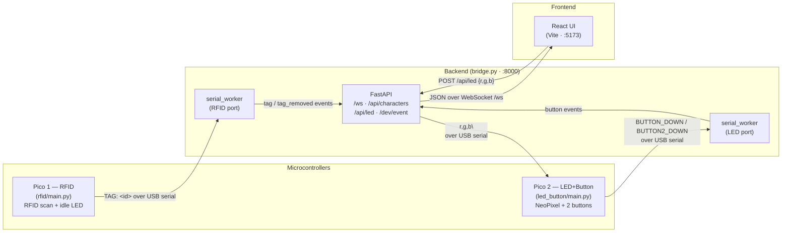
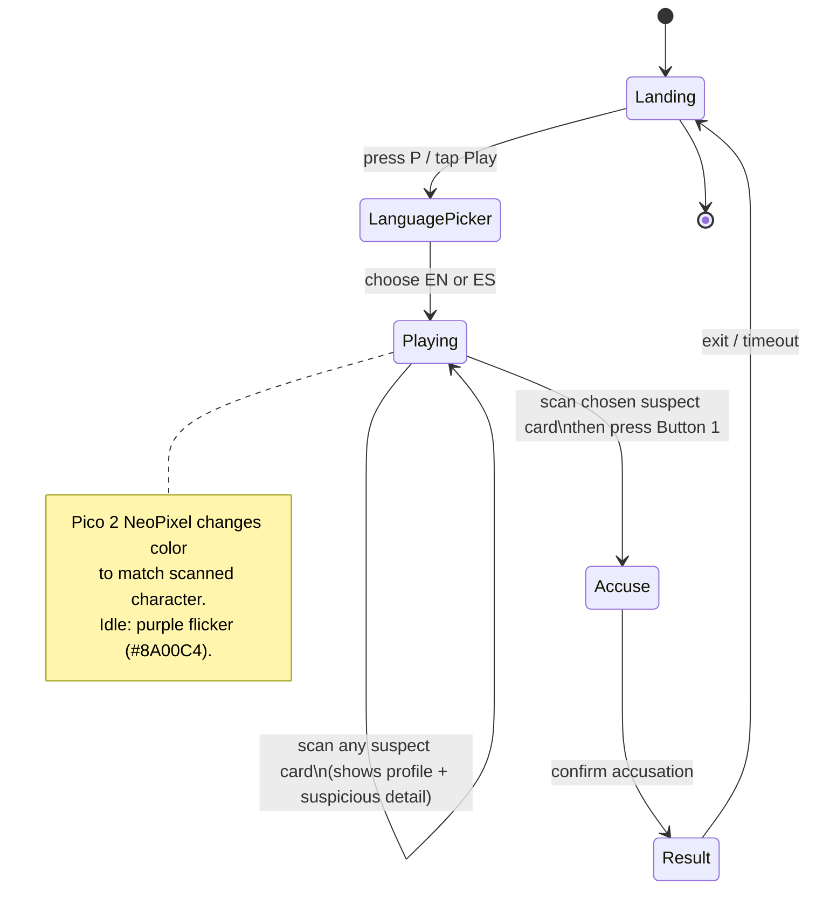
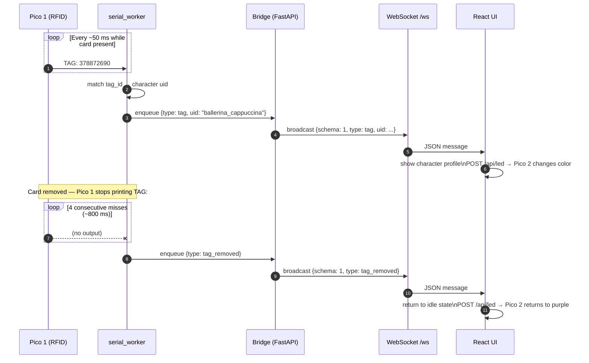
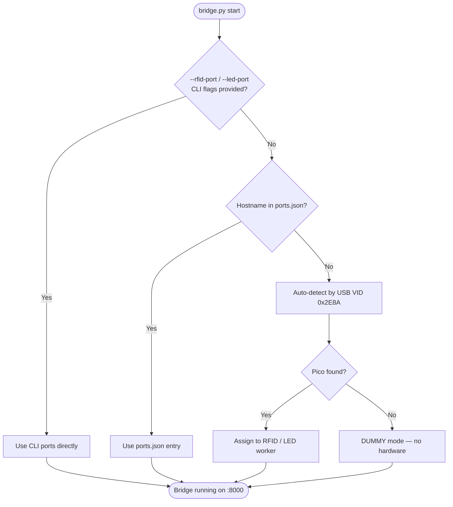

# 🔍 Pollution Mystery — TF5 Cornerstone Project

An interactive Clue-style exhibit powered by two Raspberry Pi Picos, RFID cards, NeoPixel LEDs, and a React web UI served from a Python/FastAPI backend. Players scan suspect cards to investigate river pollution and make their accusation. Made for the final project of Cornerstone of Engineering 1501/1502 at Northeastern University.

---

## System Architecture

The system has four layers that communicate in sequence.



**Fallback:** if a Pico is not connected, its `serial_worker` enters DUMMY mode — events from that device are silently dropped but the UI still loads.

---

## Game Flow



---

## Communication Sequence

The sequence below shows a full tag-scan cycle, including how the bridge infers tag removal.



**Button flow:** Pico 2 prints `BUTTON_DOWN` / `BUTTON2_DOWN` (50 ms debounce in firmware) → `serial_worker` enqueues a `button_down` / `button2_down` event → Bridge broadcasts → React advances game state.

---

## Bridge Port Detection



---

## Hardware Setup

### Parts

- 2× Raspberry Pi Pico (or Pico W)
- MFRC522 RFID reader module
- 2× NeoPixel LED strip (11-pixel for Pico 1, 24-pixel for Pico 2)
- 2× Momentary push button
- 2× USB cable (one per Pico → PC/Mac)

### Wiring

**Pico 1 — RFID** (`microcontroller/rfid/main.py`)

| Signal | Pico pin | Notes |
|--------|----------|-------|
| MFRC522 SDA/CS | GP1 | |
| MFRC522 SCK | GP2 | |
| MFRC522 MOSI | GP3 | |
| MFRC522 MISO | GP4 | |
| MFRC522 RST | GP18 | |
| MFRC522 3.3V | 3V3(OUT) | |
| MFRC522 GND | GND | |
| NeoPixel data | GP15 | n=11, idle bounce animation only |

**Pico 2 — LED + Button** (`microcontroller/led_button/main.py`)

| Signal | Pico pin | Notes |
|--------|----------|-------|
| NeoPixel data | GP28 | n=24, color driven by bridge |
| Button 1 (leg 1) | GP15 | Internal PULL_UP — no resistor needed |
| Button 1 (leg 2) | GND | |
| Button 2 (leg 1) | GP16 | Internal PULL_UP — no resistor needed |
| Button 2 (leg 2) | GND | |

Both buttons are debounced in firmware (50 ms). Button 1 confirms an accusation; Button 2 is wired for secondary interactions.

Pico 2's idle color is purple (R=138, G=0, B=196) with a random per-group flicker effect. Any RGB command sent from the bridge disables the flicker and sets a solid color.

LED power must come from **VBUS (5 V)**, not 3V3.

---

## Pico Setup

### 1. Flash MicroPython

Download the latest MicroPython `.uf2` from [micropython.org/download/rp2-pico](https://micropython.org/download/rp2-pico/).
Hold **BOOTSEL**, plug in USB, then drag the `.uf2` file onto the `RPI-RP2` drive that appears.

### 2. Install the MFRC522 library (Pico 1 only)

Download `mfrc522.py` from [github.com/wendlers/micropython-mfrc522](https://github.com/wendlers/micropython-mfrc522) and copy it to the Pico root using Thonny or rshell.

### 3. Copy the firmware

Flash each Pico separately:
- Copy `microcontroller/rfid/main.py` to the **RFID Pico** root as `main.py`
- Copy `microcontroller/led_button/main.py` to the **LED+Button Pico** root as `main.py`

Each file runs automatically on boot.

### 4. Find your tag IDs

Open a serial monitor (e.g. Thonny's shell) and scan each RFID card. The Pico prints lines like:

```
TAG: 390485036
```

Note these numbers — you'll need them when editing `characters.json`.

### RFID Card → Character Map

| Card # | Tag ID | Character |
|--------|------------|--------------------------|
| 1 | 378872690 | Ballerina Cappuccina |
| 2 | 377346306 | Roblox Noob |
| 3 | 379940674 | Roblox Guest |
| 4 | 823919036 | Baconette Hair |
| 5 | 3593868791 | Tung Tung Tung Sahur |
| 6 | 378984946 | Peeley |
| 7 | 379743602 | Agent 67 |
| 8 | 377120434 | Roblox Builder |
| 9 | 380546786 | Elsa |
| 10 | 380094082 | Steve |
| 11 | 3594085623 | Bacon Hair |
| 12 | 379725810 | SpyderSammy |

---

## Project Structure

```
project/
├── bridge.py             ← FastAPI backend — serial bridge + WebSocket server
├── bridge_protocol.py    ← versioned event schema (BRIDGE_EVENT_SCHEMA_VERSION = 1)
├── characters.json       ← character data — edit this to customise the mystery
├── ports.json            ← per-machine serial port config (keyed by hostname)
├── requirements.txt      ← Python dependencies
├── display_app.py        ← legacy PyQt5 app (superseded by web UI)
├── CITATIONS.md          ← citations
├── microcontroller/
│   ├── rfid/
│   │   └── main.py       ← MicroPython firmware for RFID Pico (Core 0: LED, Core 1: RFID)
│   └── led_button/
│       └── main.py       ← MicroPython firmware for LED+Button Pico
├── hardware/
│   └── serial_worker.py  ← thread that reads Pico serial → event queue
├── web/                  ← React/TypeScript frontend (Vite)
│   ├── src/
│   │   ├── GameShell.tsx       ← top-level game state + keyboard shortcuts
│   │   ├── gameContent.ts      ← localized copy (EN/ES)
│   │   ├── gameTypes.ts        ← TypeScript types
│   │   ├── types.ts            ← bridge WebSocket protocol types
│   │   ├── hooks/
│   │   │   └── useBridgeWebSocket.ts  ← WS connection + auto-reconnect
│   │   └── views/              ← LandingView, PlayingView, LanguagePicker, …
│   └── package.json
└── assets/
    ├── images/           ← character portrait PNGs
    └── sounds/           ← WAV files (one per character)
```

---

## PC / Mac Setup

### Install Python dependencies

```bash
python -m venv venv

# Mac/Linux:
source venv/bin/activate

# Windows:
venv\Scripts\activate

pip install -r requirements.txt
```

### Run the bridge

```bash
# Normal startup — reads ports.json for this machine's hostname, falls back to AUTO
python bridge.py

# Override ports from the command line (overrides ports.json entirely)
python bridge.py --rfid-port /dev/cu.usbmodem1101 --led-port /dev/cu.usbmodem101

# Enable dev mode (enables in-browser hardware simulation)
MYSTERY_DEV=1 python bridge.py
```

#### Per-machine port config (`ports.json`)

Each computer that runs the bridge should have an entry in `ports.json` (project root), keyed by hostname:

```json
{
  "Sachits-MacBook-Air.local": {
    "rfid_port": "/dev/cu.usbmodem1101",
    "led_port":  "/dev/cu.usbmodem101"
  },
  "exhibit-pc": {
    "rfid_port": "/dev/tty.usbmodem1101",
    "led_port":  "/dev/tty.usbmodem101"
  }
}
```

Find your hostname by running `hostname` in a terminal. On Linux/Windows exhibit machines use `tty` instead of `cu`. If the hostname isn't in the file, the bridge falls back to auto-detection.

Bridge listens on `http://127.0.0.1:8000`.

### Run the web UI

In a separate terminal:

```bash
cd web
npm install
npm run dev
```

Open `http://localhost:5173` in a browser. The Vite dev server proxies all WebSocket and API traffic to the bridge automatically.

### Production (optional)

```bash
cd web && npm run build
```

The bridge will then serve the built UI at `http://127.0.0.1:8000/` — no separate web server needed.

---

## Keyboard Shortcuts

These work in the browser and are intended for development and testing.

| Key | Action |
|-----|--------|
| `P` | Start game (from landing screen) |
| `D` | Toggle dev control panel |
| `Esc` | Close overlay / language picker |

The dev panel lets you simulate tag scans, tag removal, and button presses without physical hardware.

**Disable dev mode before the exhibit goes live** by running the bridge without `MYSTERY_DEV=1`.

---

## Customising the Mystery

Everything about the story lives in `characters.json`. Open it in any text editor.

### Changing the culprit

Set `"round_culprits"` to an array of `uid` values for the guilty character(s). One is chosen at random each game session. Update `"culprit_explanation"` with the reveal text for each.

### Adding a character

Add a new object to the `"characters"` array:

```json
{
  "uid": "colonel_mustard",
  "tag_ids": ["XXXXXXXXX"],
  "name": "Colonel Mustard",
  "role": "Retired Military Officer",
  "description": "A decorated veteran with a volatile temper...",
  "suspicious_detail": "Was seen arguing with the river warden last spring.",
  "innocent_explanation": "Mustard's argument was about fishing rights, unrelated to the spill.",
  "culprit_explanation": "Mustard had been illegally dumping from his private estate upstream.",
  "image": "assets/images/colonel_mustard.png",
  "led_color": [200, 150, 0]
}
```

- `uid` — short identifier used internally (letters and underscores only).
- `tag_ids` — one or more raw tag numbers printed by the Pico. Multiple IDs let you assign several physical cards to one character.
- `led_color` — RGB `[R, G, B]` sent to Pico 2's NeoPixel strip when this character is scanned.
- `image` — path to a portrait PNG relative to the project root.
- `innocent_explanation` / `culprit_explanation` — text shown at the reveal depending on outcome.

The app reloads `characters.json` on each launch — no code changes needed.

### Editing UI copy or translations

Localized strings (EN/ES) live in `web/src/gameContent.ts`.

---

## Troubleshooting

**Bridge says "Could not auto-detect Pico"**
Pass ports manually with `--rfid-port` and `--led-port`. On Mac, run `ls /dev/cu.usbmodem*` to list both. On Windows, check Device Manager under Ports (COM & LPT). If both Picos show the same VID, unplug one at a time to identify which port is which.

**Tag scans do nothing**
Open a serial monitor and scan the card. Check that the number printed matches a `tag_ids` value in `characters.json` exactly (plain decimal string).

**LEDs don't light up**
Confirm the data wire is on GP28. Check that `n` in `microcontroller/led_button/main.py` matches your actual pixel count. LED power must come from VBUS (5V), not 3V3. Also confirm `--led-port` points to the LED+Button Pico, not the RFID one.

**UI won't connect to bridge**
Make sure `python bridge.py` is running before opening the browser. Check the terminal for port errors. The status line in the dev panel shows connection state.
